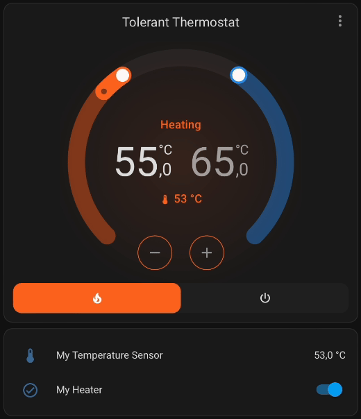

# Tolerant Thermostat

### Key features:
- two target temperature setpoints instead of tolerances
- supports invert logic for heater/cooler

### Main logic explanation:
Tolerant thermostat does not have any tolerances: all behaviour is based on two temperature setpoints.
For example, heater will be turned on when current temperature drops below `target_temperature_low`
and will be turned off when current temperature rises above `target_temperature_high`.
Logic will be opposite for coolers respectively.

## Installation (via HACS)

This is recommended way, which will handle one-click upgrade in HACS.

1. Install [hacs] if it is not installed.
2. Open HACS -> Integrations. Click 3 dots in the upper right corner.
3. Click Custom repositories.
4. Add `vaproloff/tolerant-thermostat` repository.
5. Find `Tolerant Thermostat` in HACS catalog and click `install` button.

## Installation (Manual)

NOTE: This is not recommended way, because you will need to upgrade component manually. 

1. Copy `/custom_components/tolerant_thermostat` to your `<config_dir>/custom_components/` directory.

   * On HassIO the final location will be `/config/custom_components/tolerant_thermostat`.
   * On Supervised the final location will be `/usr/share/hassio/homeassistant/custom_components/tolerant_thermostat`.
   * _NOTE: You will need to create the `custom_components` folder if it does not exist._

2. Restart Home Assistant Core.

## Setup
> Configuration > Integrations > ADD INTEGRATION > **Tolerant Thermostat**
